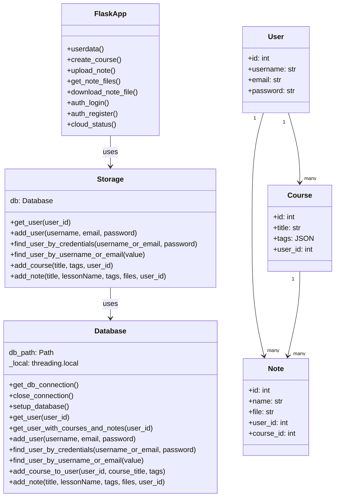
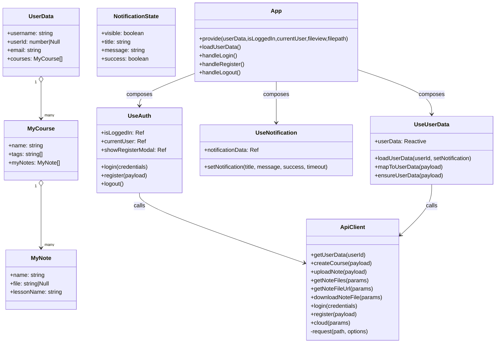

# 项目类图

---

## 后端类图（Python / Flask）

要点：
- Flask 路由作为控制器层，全部通过 `Storage`（门面）访问 `Database`。
- `Database` 负责连接复用、DDL 初始化，以及增删查业务。
- 领域数据以三张表表示：`users`、`courses`、`notes`，`Course.tags` 为 JSON 字符串；`Note.file` 为单文件名（文本）。

---

## 前端类图（Vue 3 / 组合式 API）

要点：
- `useUserData` 内部定义 `MyCourse / MyNote` 两个类并维护一个全局响应式 `userData`。
- `useAuth` / `useUserData` 通过 `ApiClient` 访问后端。
- `App.vue` 提供 `provide` 注入 `userData`、`isLoggedIn`、`currentUser`、`fileview`、`filepath` 等给子组件。

---

