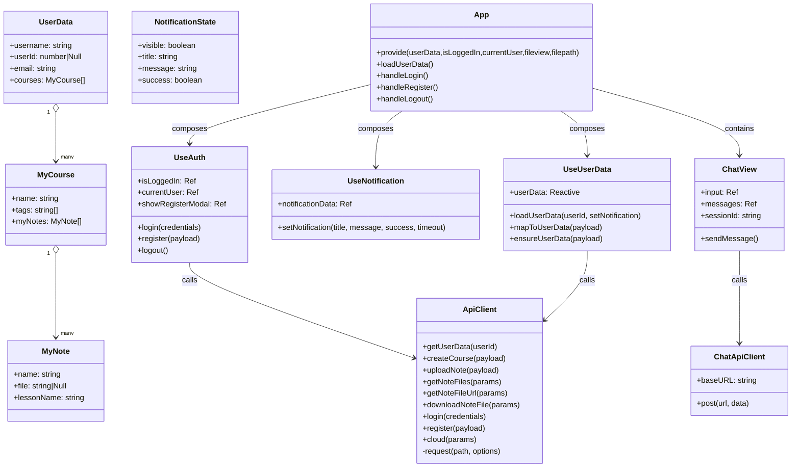

# 项目类图

---

## 后端类图（Python / Flask & FastAPI）

要点：
- Flask 路由作为控制器层，全部通过 `Storage`（门面）访问 `Database`。
- `ChatApp` (FastAPI) 独立运行，负责处理 AI 对话请求，管理 `ChatSession`。
- `SpiderService` 封装了爬虫逻辑，包括登录北大门户、抓取作业信息以及调用 LLM 解析 DDL。
- `Database` 负责连接复用、DDL 初始化，以及增删查业务。
- 领域数据扩展为多张表：`users`、`courses`、`notes`、`link_categories`、`useful_links`、`tasks`、`course_schedules` 等。
- `Course.tags` 为 JSON 字符串；`Note.file` 为单文件名（文本）。
- 常用链接 (`UsefulLink`) 按分类 (`LinkCategory`) 组织。
- 任务 (`Task`) 包含截止日期和状态管理。
- 课程表 (`CourseSchedule`) 支持多时段 (`CourseScheduleTime`) 和周次类型设置。

---

## 前端类图（Vue 3 / 组合式 API）

要点：
- `useUserData` 内部定义 `MyCourse / MyNote` 两个类并维护一个全局响应式 `userData`。
- `useAuth` / `useUserData` 通过 `ApiClient` 访问后端 Flask 服务。
- `ChatView` 组件通过独立的 `ChatApiClient` 访问后端 FastAPI AI 服务。
- `App.vue` 提供 `provide` 注入 `userData`、`isLoggedIn`、`currentUser`、`fileview`、`filepath` 等给子组件。

